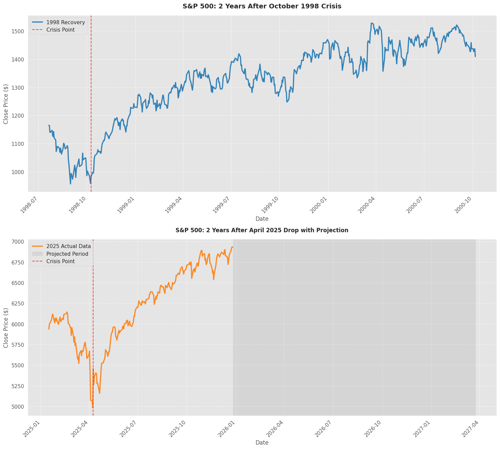
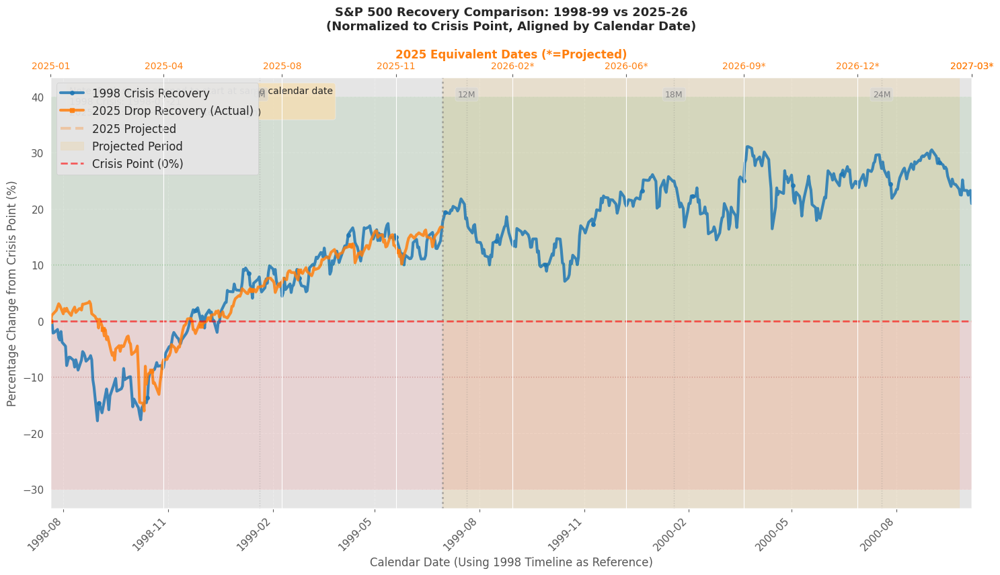
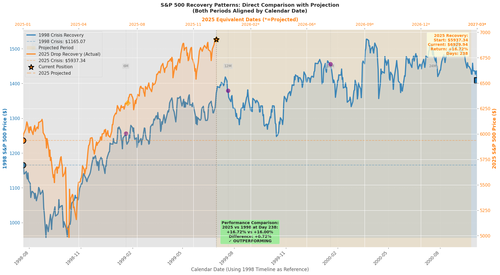
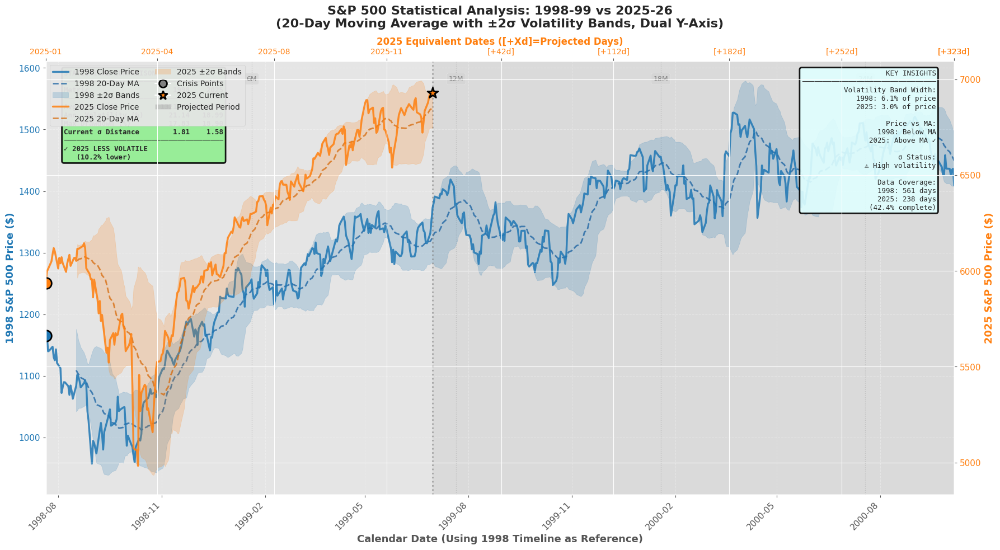
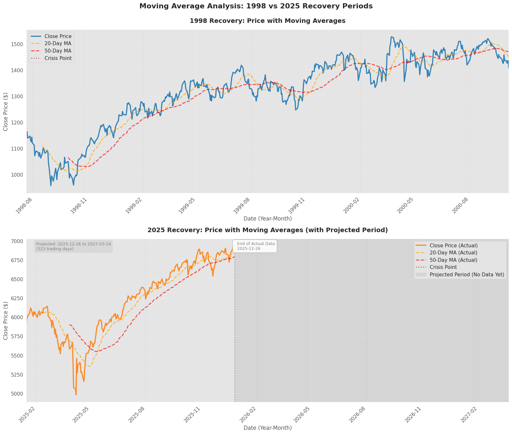
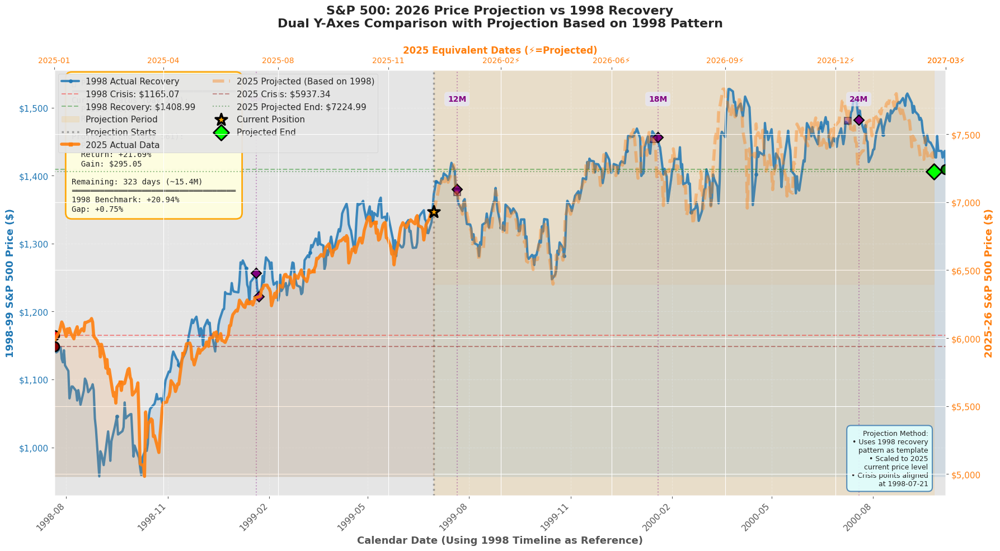

# S&P 500 Recovery Pattern Analysis: 1998-99 vs 2025-26


[](https://opensource.org/licenses/MIT)
[](https://www.python.org/)
[](https://jupyter.org/)
[]()


##  1. OVERVIEW

### Objective
Comprehensive comparison of market recovery patterns between the **1998 Crisis** and **2025 Market Drop**, analyzing whether historical patterns can predict future recovery trajectories through detailed technical and statistical analysis.

- [KAGGLE NOTEBOOK](https://www.kaggle.com/code/xxxxyyyy80008/s-p-500-recovery-analysis-1998-vs-2025/)
- [GITHUB NOTEBOOK](https://github.com/xxxxyyyy80008/Market-Recovery-Pattern-1998-vs-2025/blob/main/notebooks/sp500-recovery-analysis.ipynb)

### Comparison Periods
- **Historical Benchmark**: 1998-1999 Crisis Recovery (24 months)
- **Current Analysis**: 2025-2026 Market Drop Recovery (actual data + projections)

### Key Crisis Dates
- **1998 Crisis Trough**: October 8, 1998
- **2025 Crisis Trough**: April 8, 2025
- **Analysis Window**: 24 months (504 trading days) post-crisis
- **Pre-Crisis Context**: 57 trading days included for trend analysis

---

##  2. METHODOLOGY

### Data Processing Methodology

#### 1. **Date Alignment Strategy**
- Both periods aligned to start at the same calendar date
- Crisis points synchronized for direct visual comparison
- 1998 timeline used as reference baseline
- 2025 dates shifted to overlay on 1998 timeline

#### 2. **Data Padding & Projection**
When 2025 data is incomplete:
- Historical pattern extrapolation using 1998 recovery trajectory
- Scaling factor applied to match current 2025 price levels
- Clear distinction between actual and projected data
- Projected period shaded/marked in visualizations

#### 3. **Normalization Methods**
- **Percentage Change**: All prices normalized to crisis point (0% reference)
- **Index-based**: First trading day = 100
- **Calendar Alignment**: Date offsets calculated for temporal comparison

---

##  3. VISUALIZATIONS

### **Core Price Comparisons**

#### **Visualization 1: Absolute Price Comparison**
- Side-by-side subplots showing actual prices
- Separate timelines for each crisis period
- Crisis point markers clearly indicated
- Projected period shading (if applicable)


**Key Elements**:
- Date format: YYYY-MM with 3-month intervals
- Crisis point marked with vertical dashed line
- Actual vs projected data distinguished by opacity/shading

#### **Visualization 2: Normalized Overlay Comparison**
- Single chart with both series overlaid
- Crisis points aligned to 0% baseline
- Percentage returns from crisis point
- Secondary x-axis showing 2025 equivalent dates


**Features**:
- 1998 series: Blue line, circular markers
- 2025 actual: Orange line, square markers
- 2025 projected: Dashed orange line (if applicable)
- Milestone markers every 6 months
- Positive/negative territory shading

#### **Visualization 3: Dual Y-Axis Timeline Comparison**
- Single chart with independent Y-axes for each period
- Left axis: 1998 prices ($)
- Right axis: 2025 prices ($)
- Direct visual comparison of recovery magnitude


**Annotations Include**:
- Starting prices and returns for both periods
- Current position marker (2025)
- Performance comparison box
- Month interval markers (6M, 12M, 18M, 24M)

### **Statistical Analysis**

#### **Visualization 4: Statistical Summary with Volatility Bands**
- Dual Y-axis statistical overlay
- 20-day moving average for both periods
- ±2σ (standard deviation) volatility bands
- Bollinger Band-style analysis


**Statistical Metrics Displayed**:
- Average price comparison
- Annualized volatility (%)
- Maximum drawdown from peak (%)
- Current sigma distance from mean
- Band width as percentage of price

**Key Insights Box**:
- Volatility comparison (more/less/similar)
- Price position vs moving average
- Sigma status (high volatility/stabilizing/normal)
- Data coverage percentage

#### **Visualization 5: Daily Returns Distribution**
- Histogram comparison (1998 vs 2025)
- Mean return marked with vertical line
- Zero-line reference
- Frequency distribution of daily percentage changes


**Metrics**:
- Mean daily return
- Standard deviation
- Distribution shape comparison
- Outlier identification

#### **Visualization 6: Cumulative Returns**
- Progressive return tracking from crisis point
- Compounded daily returns
- Zero-line baseline reference
- Time-series comparison


**Shows**:
- Total cumulative gain/loss over time
- Relative performance trajectory
- Recovery acceleration patterns

### **Technical Analysis**

#### **Visualization 7: Moving Average Analysis**
- 20-day and 50-day moving averages
- Price crossover identification
- Trend signals (bullish/bearish)
- Support/resistance level visualization


**Technical Signals**:
- 20-MA above 50-MA: Bullish trend
- 20-MA below 50-MA: Bearish trend
- Price above/below MA: Momentum indication
- Moving average convergence/divergence

**Summary Statistics**:
- Final MA values and deviations
- Trend status assessment
- Days until MA calculations become meaningful

#### **Visualization 8: Rolling Volatility (20-Day Window)**
- Annualized volatility over time
- Volatility spikes identification
- Market stabilization tracking
- 20% high volatility reference line


**Insights**:
- Volatility clustering periods
- Market calm vs turbulent phases
- Recovery stability assessment

#### **Visualization 9: Risk-Reward Analysis**
Two-part visualization:

**Part A - Scenario Analysis**:
- Bear Case: -10% return (10% probability)
- Base Case: +5% return (20% probability)
- Bull Case: +30% return (50% probability)
- Best Case: +45% return (20% probability)

**Part B - Investment Strategy Scatter**:
- X-axis: Maximum Drawdown Risk (%)
- Y-axis: Expected Return (%)
- Strategies plotted:
  - Conservative DCA
  - Moderate DCA
  - Aggressive Entry
  - Leveraged 1.5x
- Optimal zone highlighted (8-18% risk, 15-35% return)


#### **Visualization 10: Price Projection Chart**
- Complete 1998 recovery on left Y-axis
- 2025 actual + projected on right Y-axis
- Projection methodology clearly indicated
- Milestone markers (6M, 12M, 18M, 24M)


**Projection Method**:
1. Use 1998 pattern as template
2. Scale to match 2025 current price level
3. Apply growth rates from historical pattern
4. Mark transition from actual to projected data

**Key Information Boxes**:
- Current status (price, return, days elapsed)
- Projected end state (price, return, expected gain)
- Days/months remaining
- 1998 benchmark comparison
- Projection methodology note

### **Comprehensive Summary**

#### **Visualization 11: Multi-Panel Analysis Dashboard**
9-panel grid layout providing holistic view:

**Top Row (Metrics)**:
1. **1998 Crisis Metrics**: Crisis/recovery prices, total return, duration, volatility, max drawdown
2. **2025 Crisis Metrics**: Current prices, return to date, duration, volatility, max drawdown
3. **Performance Comparison**: Verdict (outperforming/tracking/underperforming), progress percentage

**Middle Row (Returns)**:
4. **Normalized Returns**: Percentage change from crisis point, aligned timelines
5. **Cumulative Returns**: Compounded gains over time with area fill
6. **30-Day Rolling Volatility**: Annualized volatility comparison with 20% reference line

**Bottom Row (Risk Analysis)**:
7. **Drawdown from Peak**: Maximum loss from running high, -10%/-20% reference lines
8. **Recovery Speed Table**: 
   - Milestone achievements (+5%, +10%, +15%, +20%)
   - Days to reach each milestone
   - 1998 vs 2025 comparison
   - Overall pace assessment


---

##  4. KEY METRICS

### Price Performance
- **Starting Price**: Crisis point price ($)
- **Ending/Current Price**: Final or most recent price ($)
- **Minimum Price**: Lowest point during period ($)
- **Maximum Price**: Highest point during period ($)
- **Total Return**: Percentage gain/loss from crisis point (%)
- **Max Drawdown**: Largest peak-to-trough decline (%)
- **Max Gain**: Largest gain from starting point (%)
- **Average Price**: Mean price over entire period ($)

### Risk Metrics
- **Annualized Volatility**: Standard deviation of daily returns × √252 (%)
- **Daily Return Mean**: Average daily percentage change (%)
- **Daily Return Std Dev**: Standard deviation of daily returns (%)
- **Sharpe-style Ratios**: Risk-adjusted return calculations
- **Sigma Distance**: Current deviation from moving average (σ)

### Technical Indicators
- **20-Day Moving Average**: Short-term trend indicator
- **50-Day Moving Average**: Medium-term trend indicator
- **Bollinger Bands**: ±2σ volatility bands around 20-day MA
- **Band Width**: Volatility band range as % of price
- **Price vs MA**: Position above/below moving averages

### Recovery Metrics
- **Days to Milestones**: Time to reach +5%, +10%, +15%, +20% recovery
- **Cumulative Returns**: Compounded daily returns over time
- **Recovery Speed**: Comparative pace of recovery (1998 vs 2025)
- **Progress Percentage**: % of expected recovery period completed

---

##  5. LIMITATIONS

### **Projection Limitations**
- **Assumption**: 2025 follows 1998 pattern
- **Reality**: Each crisis is unique with different:
  - Economic fundamentals
  - Market structure
  - Policy responses
  - Global conditions

### **Projection Method**
- Simple pattern replication, not econometric modeling
- No consideration of fundamental differences
- Scaling assumes linear relationship
- No regime change modeling


---

##  6. CONFIGURATIONS

### Fixed Parameters
- **Random Seed**: 3407 (for reproducibility)
- **Trading Days/Month**: 21
- **Analysis Months**: 24
- **Prior Days Context**: 57
- **Moving Average Windows**: 20-day, 50-day
- **Volatility Window**: 20-day rolling
- **Annualization Factor**: √252 (trading days/year)
- **Bollinger Bands**: ±2σ

#### Dependencies
```bash
# Install required packages
pip install -r notebooks/requirements.txt

```

---

##  7. License

This project is licensed under the MIT License - see the LICENSE file for details.
