# S&P 500 Recovery Pattern Analysis: 1998-99 vs 2025-26

##  1. OVERVIEW

### Objective
Comprehensive comparison of market recovery patterns between the **1998 Crisis** and **2025 Market Drop**, analyzing whether historical patterns can predict future recovery trajectories through detailed technical and statistical analysis.

- [KAGGLE NOTEBOOK](https://www.kaggle.com/code/xxxxyyyy80008/s-p-500-recovery-analysis-1998-vs-2025/)
- [GITHUB NOTEBOOK](https://github.com/xxxxyyyy80008/Market-Recovery-Pattern-1998-vs-2025/blob/main/notebooks/sp500-recovery-analysis.ipynb)

## Comparison design

### 1) Anchoring event
We define the “crisis point” as the intended trough date and snap to the **nearest trading day**:
- 1998 trough: `1998-10-08`
- 2025 trough: `2025-04-08`

### 2) Window construction
For each trough:
- include **57 prior trading days** for context (pre-trough slope and volatility)
- analyze **24 months** forward using $$21$$ trading days/month:
  $$
  T \approx 57 + 24 \times 21
  $$

The 2025 window is **padded** with business days if it is shorter than the 1998 window to keep plotting/alignments consistent. Padded dates are treated as **future / projected** and are kept separate via an `actual_mask`.

---

## Core transformations 

### Normalized path (shape comparison)
To compare *shape*, we normalize each recovery path to its first valid observation:
$$
\mathrm{norm}(P_t)=100\left(\frac{P_t}{P_0}-1\right)
$$

### Dual-timeline alignment (calendar overlay)
To overlay the 2025 path onto the 1998 axis, dates are shifted by a constant offset:
$$
t'_{2025} = t_{2025} + (t_{1998,0} - t_{2025,0})
$$

This enables side-by-side inspection of “month $$m$$ after trough” dynamics while still using readable calendar ticks.

---

## Projection method 
When 2025 has fewer observations than the 1998 benchmark, the script can build a *shape-implied* continuation:

1. Take the corresponding future segment of the 1998 recovery path.
2. Scale it to the 2025 level using a multiplicative factor:
   $$
   \hat{P}^{2025}_{t} = P^{1998}_{t} \times \frac{P^{2025}_{\text{last actual}}}{P^{1998}_{\text{reference}}}
   $$
3. Fill only as many padded future rows as safely available (length-safe, no index errors).

**Interpretation:** this is a **conditional path hypothesis**: “If 2025 follows the *shape* of 1998 from this point, what would the implied level path look like?”

---

## Recovery speed diagnostics 
To make “pace” comparable, the script computes **time-to-reach** milestone gains from trough:
- +5%, +10%, +15%, +20%

For each gain threshold $$g$$:
- find the first date where $$P_t \ge P_{\text{trough}}(1+g)$$
- report days elapsed for 1998 vs 2025 (actual only)

This yields an interpretable *recovery speed table* rather than relying purely on visual similarity.

---

## Caveats 
- This is **not** a causal forecast.
- Scenario panel (Viz 9) is **assumption-driven** and should not be treated as inference.

## Visualizations

A set of plots intended to answer:  **“Is 2025 recovering like 1998, and if so, in what dimensions?”**

1. **Absolute price paths** (1998 full; 2025 actual + shaded projection region)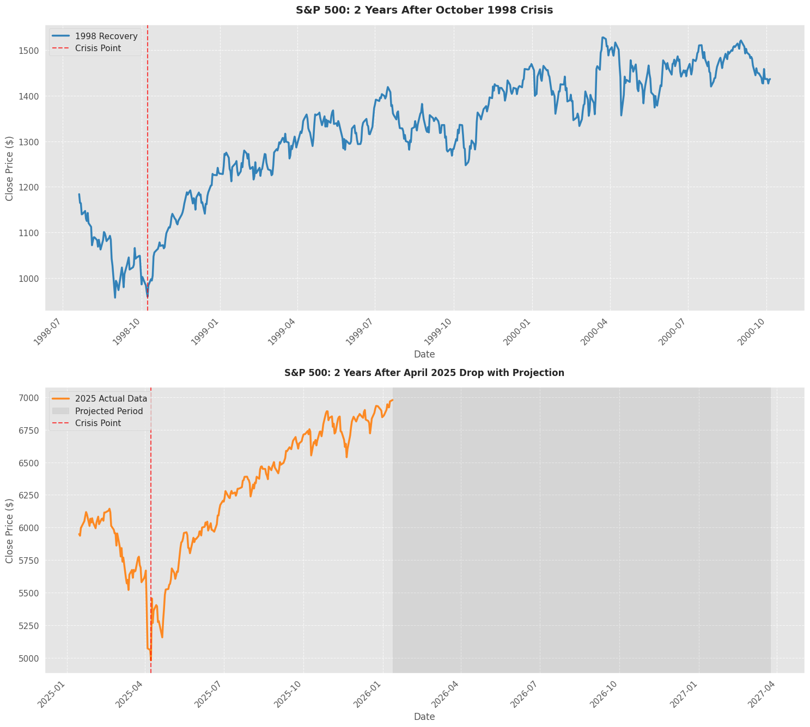
2. **Normalized recovery paths** (aligned by start date; 0% reference line at trough)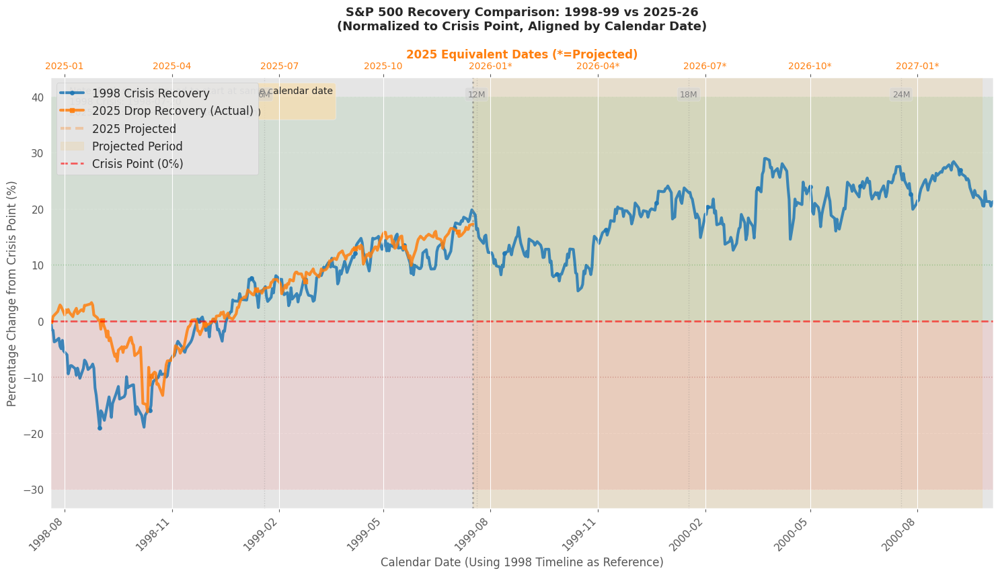
3. **Dual y-axis overlay** (1998 on left axis, 2025 on right axis; same x-grid)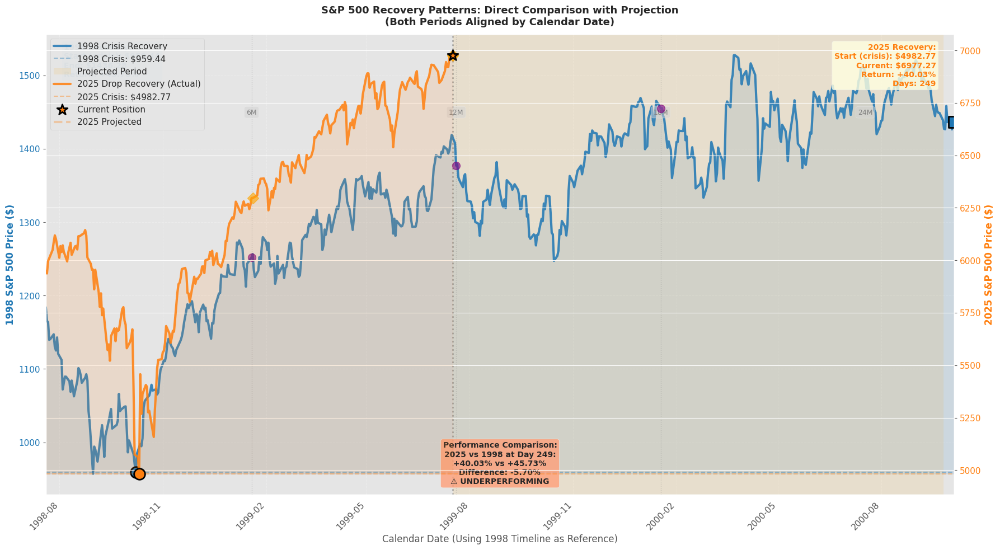
4. **20D moving average + ±2σ bands** (volatility regime and stabilization check)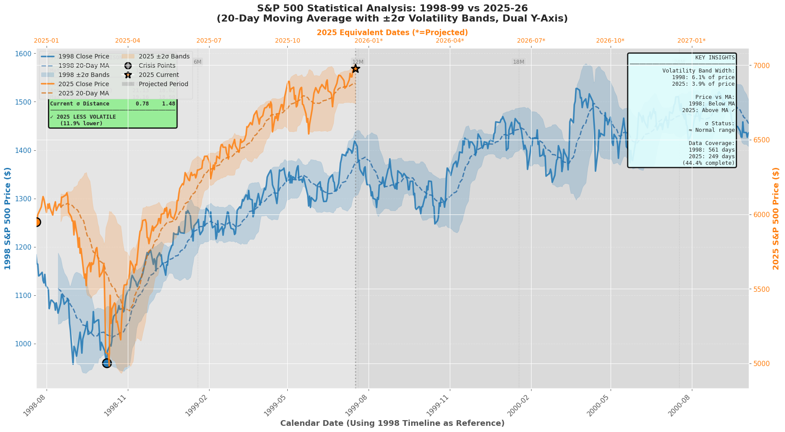
5. **Daily return distributions** (mean/dispersion/skew differences)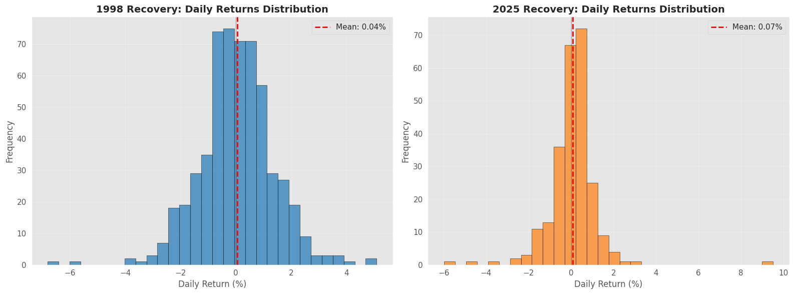
6. **Cumulative returns** since trough (path dependence)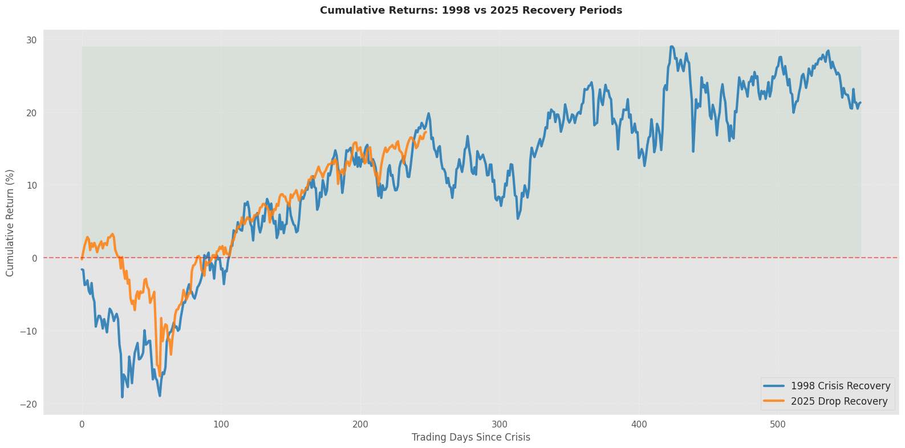
7. **Moving averages (20D/50D)** (trend and time-to-signal; guarded for short samples)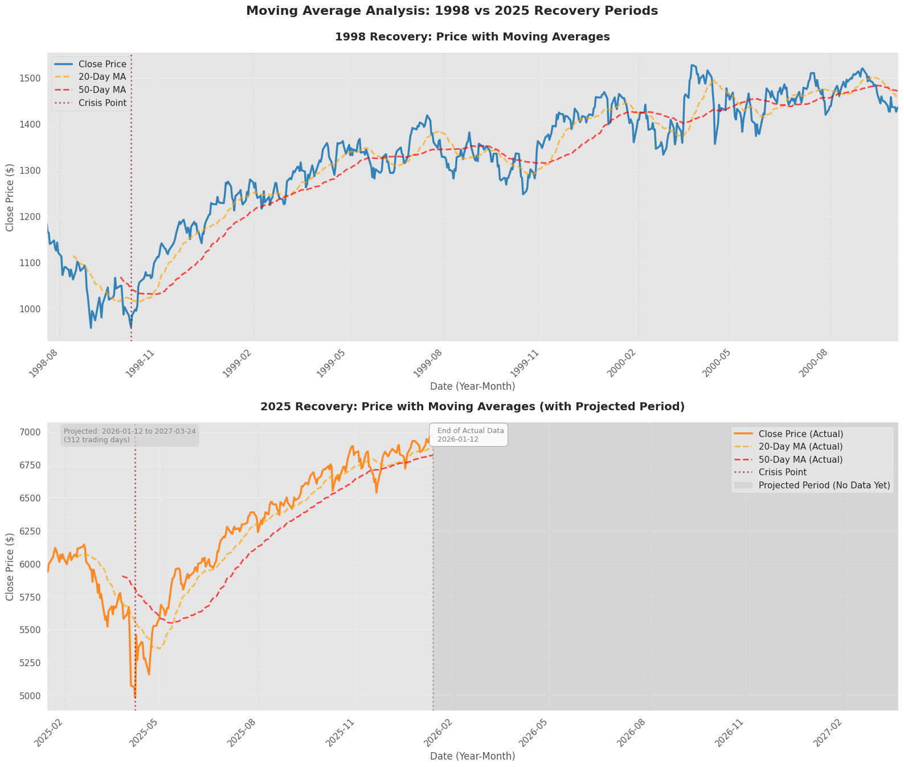
8. **Rolling realized volatility** (annualized; windowed; 20% reference level)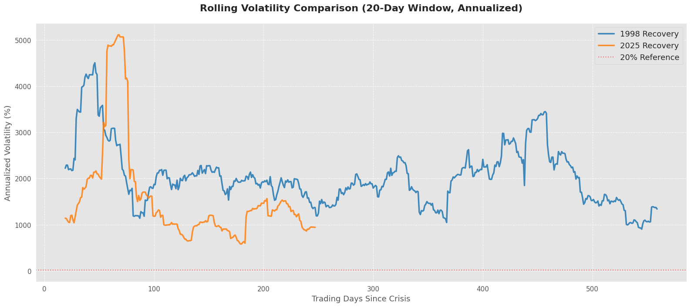
9. **Risk–reward scenario panel** (explicit assumptions; not model-estimated)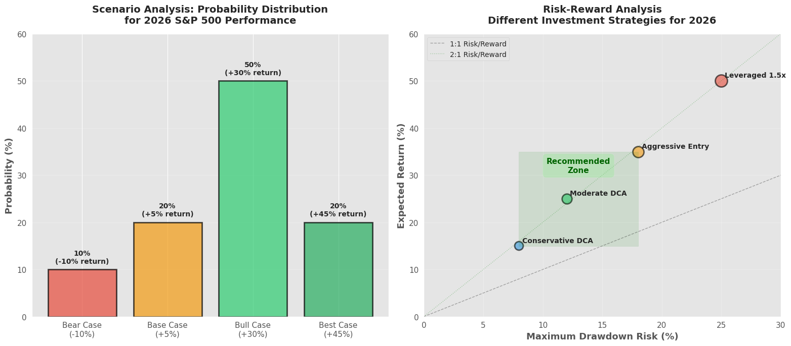
10. **Template-based projection** (scale 1998 “future segment” to 2025 price level)
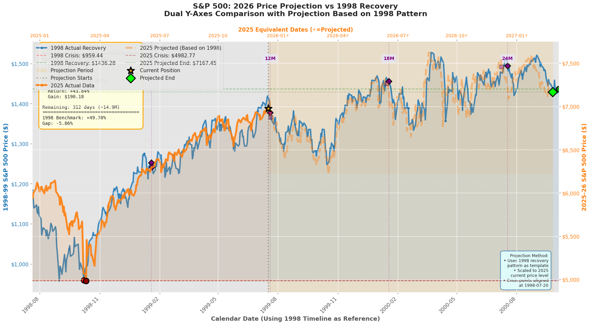
11. **Summary Dashboard**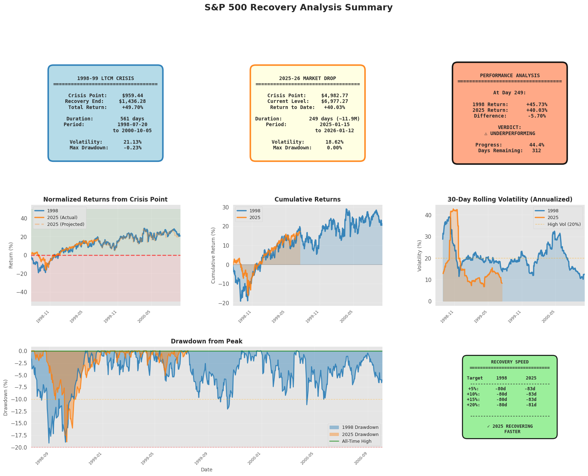
